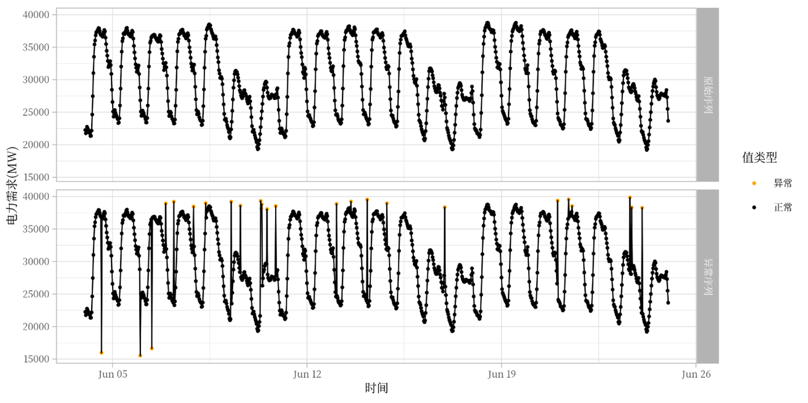
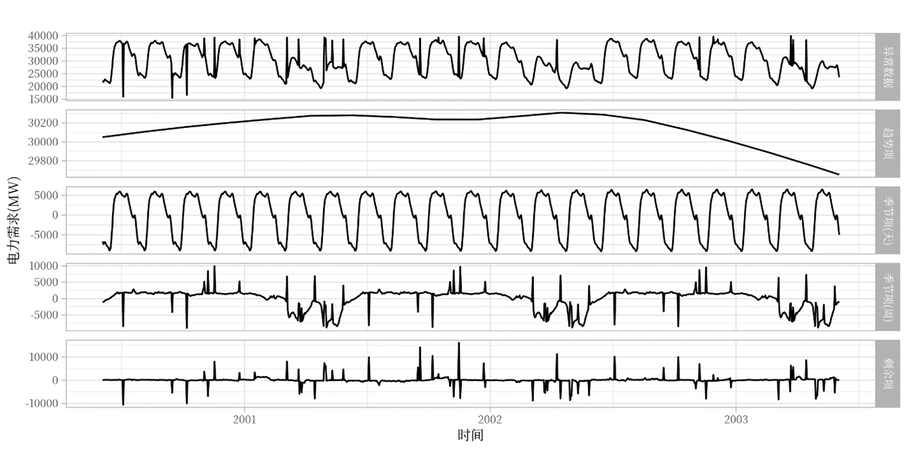
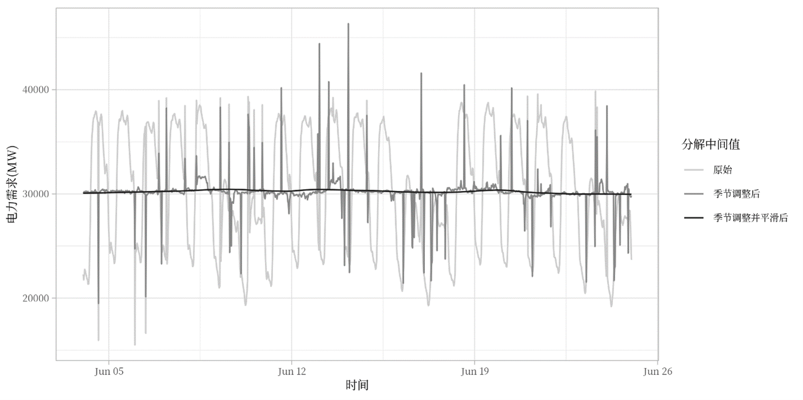
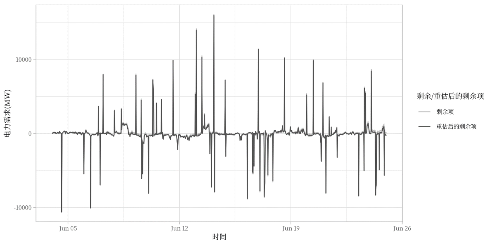
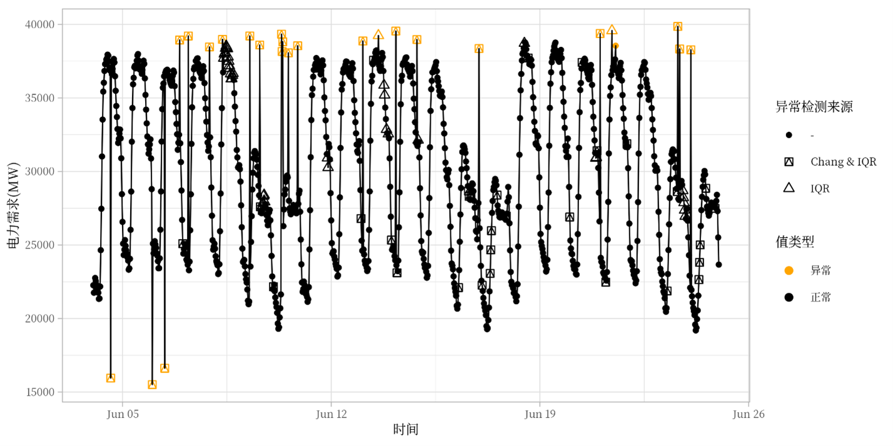
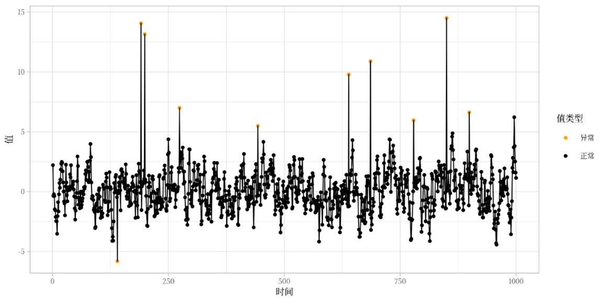
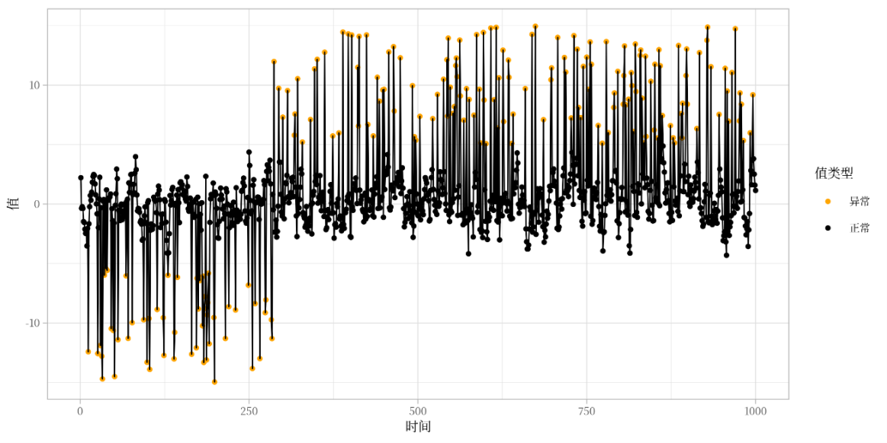
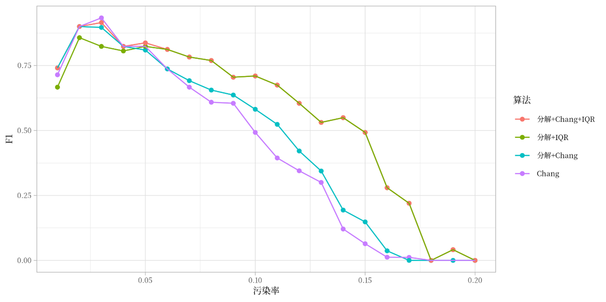
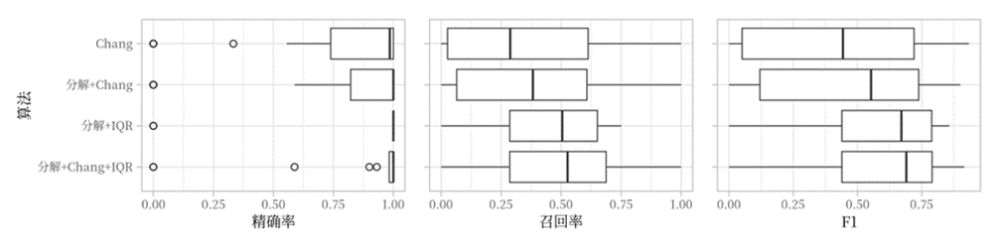

# Time series anomaly detection

> This repository is for our article on time series anomaly detection.

Mainly for creating relevant plots:

|  |  |  |
|-------------------|-------------------|-------------------|
|  |  |  |
|  |  |  |
